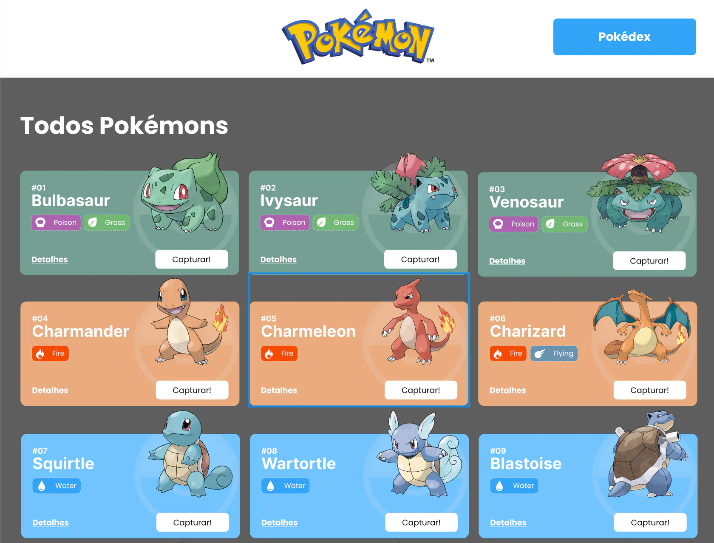
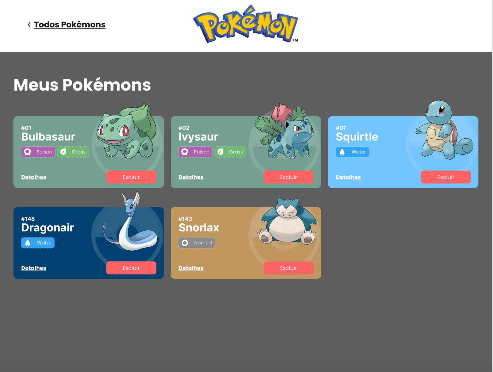
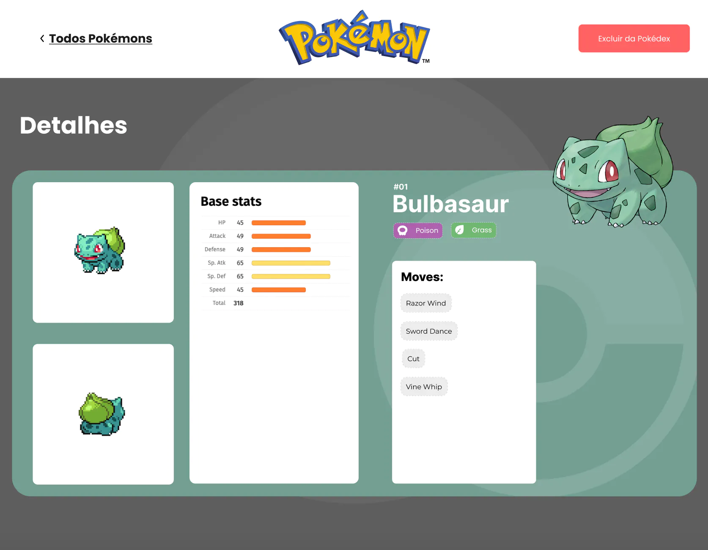

# Projeto Pokedex


Projeto Frontend com React: APIs. Todas informações são da API [Poke Api](https://pokeapi.co/ "Poke Api")

## Índice
- <a href="#Funcionalidades do projeto">Funcionalidades do projeto
- <a href="#Layout">Layout
- <a href="#Demonstração">Demonstração
- <a href="#Como Rodar esse Projeto">Como Rodar esse Projeto

- <a href="#Tecnologias Utilizadas">Tecnologias utilizadas
- <a href="#Pessoas Autoras">Pessoas Autoras

## Funcionalidades do  projeto
- Gerais
- [x] 3 páginas: Home, Pokedex e detalhes;
- Página Home;
- [x] Lista de Pokemons, contendo 20 Pokemons;
- [x] Cada Pokemon é representado por um Card;
- [x] Em cada Card de pokemon tem um botão para adicioná-lo à Pokedex e um outro botão para acessar os detalhes do Pokemon;
- [x] Header dessa página tem um botão para acessar a página Pokedex;
- Página Pokedex
- [x] Renderizar a lista de pokémons adicionados na pokedex;
- [x] Em cada card de Pokemon tem um botão para removê-lo da Pokedex e um outro botão para acessar os detalhes do Pokemon;
- [x] Header tem um botão para voltar para a Home;
- [x] Não é possível adicionar o mesmo Pokemon duas vezes na Pokedex;
- Página de Detalhes
- [x] Mostrar os detalhes do Pokemon selecionado, com informações descritas;
- [x] Header tem um botão para adicionar ou remover da Pokedex e outro para voltar a página home.

## Layout




## Demonstração 
{Link demonstração}(rafael-machado-pokedex.surge.sh)


## Como Rodar esse Projeto
```bash
# Clone este repositório
$ git clone linkrepo

# Acesse a pasta do projeto no seu terminal
$ cd pokedex

#Instale as dependências
$ npm install

# Execute a aplicação
$ npm start

# A aplicação será iniciada na porta 3000, acesse pelo navegador: http://localhost:3000
```
## Tecnologias Utilizadas
1. [React](https://pt-br.reactjs.org/)
2. [React Router](https://reactrouter.com/en/main)
3. [Styled-components](https://styled-components.com/)
4. [React Context](https://reactjs.org/docs/context.html)
5. [Axios](https://www.npmjs.com/package/react-axios)

## Pessoas Autoras


